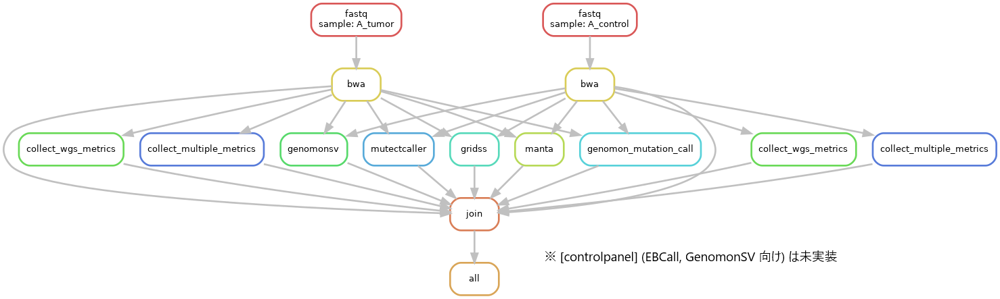

[](https://travis-ci.com/github/ncc-ccat-gap/GCATWorkflowCloud)

[](https://www.gnu.org/licenses/gpl-3.0)

# GCAT-Workflow Cloud

# Installation

## GCAT-Workflow Cloud

```sh
https://github.com/ncc-ccat-gap/GCATWorkflowCloud.git
cd GCATWorkflowCloud
python setup.py build install
```

## Dependency

See, https://github.com/aokad/ecsub

# Quick Start

Run with us-east-1.

```sh
export YOUR_BUCKET=s3://aokad-ana-virginia

gcat_workflow_cloud germline \
  example_conf/germline_sample.csv \
  ${YOUR_BUCKET}/gcat_workflow_cloud_test \
  example_conf/germline_gcat_ecsub.cfg
```

# Pipelines

## germline


## somatic



## rna


